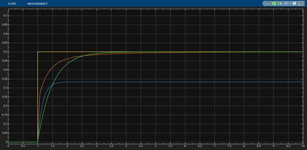
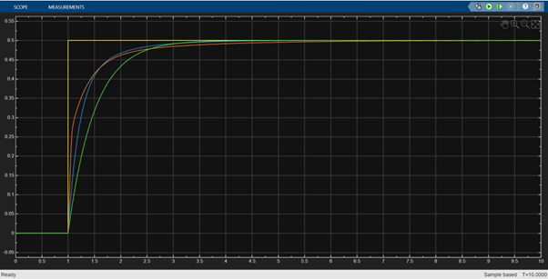
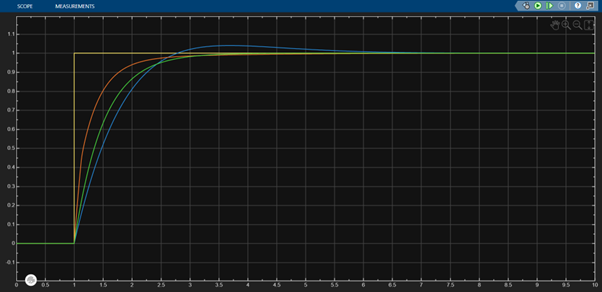
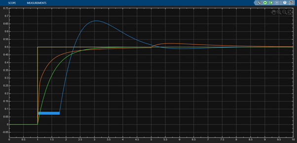

# DC Motor Speed Control using PID Controller in Simulink

This project models DC motor speed control using a PID controller in MATLAB/Simulink. Performance is compared across three control strategies — no control, manual PID tuning, and optimized PID. Results demonstrate improved rise time, reduced steady-state error, and enhanced stability.

---

## Overview

This project focuses on modeling and controlling the speed of a DC motor using a PID (Proportional–Integral–Derivative) controller in Simulink. A closed-loop feedback system is designed to analyze and compare system performance under different control strategies. Each case is simulated simultaneously and results are overlaid on a single scope for direct comparison.

---

## Objectives

- Model a DC motor using a first-order transfer function
- Design a closed-loop PID control system in Simulink
- Implement PID manually using P, I, D blocks
- Compare manual PID with Simulink's auto-tuned PID block
- Analyze the effect of individual PID parameters (Kp, Ki, Kd)
- Study system behavior under step input variations

---

## System Model

The DC motor is approximated as a first-order system:

```
G(s) = 1 / (0.5s + 1)

Time constant = 0.5 seconds
DC Gain       = 1
```

---

## PID Controller

The control signal is given by:

```
u(t) = Kp·e(t) + Ki·∫e(t)dt + Kd·(de/dt)
```

Where:
- **Kp** = Proportional gain → improves response speed
- **Ki** = Integral gain → eliminates steady-state error
- **Kd** = Derivative gain → reduces overshoot and oscillations

---

## Simulation Cases

### Case 1: Without PID (Open Loop)
- Step input fed directly to motor, no feedback
- Result: slow response, large steady-state error

### Case 2: Manual PID
- Kp = 3, Ki = 2, Kd = 1
- Hand-tuned using P, I, D gain blocks
- Result: improved response, some overshoot

### Case 3: Tuned PID
- Kp = 5, Ki = 3, Kd = 1
- Implemented using Simulink PID Controller block
- Result: fastest rise, minimal overshoot, best stability

---

## Parameter Study

| Test | What is varied | What is fixed |
|------|---------------|---------------|
| Kp effect | Kp varied | Ki = Kd = 0 |
| Ki effect | Ki varied | Kp fixed, Kd = 0 |
| Kd effect | Kd varied | Kp, Ki fixed |
| Step variation | Step = 0.5, 1, 2, 5 | PID gains fixed |
| Disturbance test | External disturbance added | All gains fixed |

---

## Results

| Case | Rise Time | Steady-State Error | Overshoot |
|------|-----------|--------------------|-----------|
| No PID | Slow | High | None |
| Manual PID | Moderate | Low | Moderate |
| Tuned PID | Fast | Near zero | Minimal |

The comparison shows:
- Without PID → slow and inaccurate response
- Manual PID → moderate improvement in speed and accuracy
- Tuned PID → fastest, most stable, best tracking

---

## Simulink Model


### Model with Disturbance


---

## Output Graphs

### Base Comparison


### Step Varied — 0.5
.png)

### Step Varied — 2
.png)

### Step Varied — 5
.png)

### Kp Varied (Ki=Kd=0)


### Ki Varied (Kp fixed, Kd=0)


### Kd Varied (Kp, Ki fixed)


### Disturbance Introduced


---

## Project Report

You can view the detailed report here:  
[Download Report](ABSTRACT.pdf)

---

## Tools Used

- MATLAB
- Simulink
- Continuous block library (Transfer Fcn, Integrator, Derivative)
- Simulink PID Controller block
- Mux, Scope, Saturation blocks

---

## Key Learnings

- Closed-loop feedback improves system performance over open-loop
- Kp increases response speed but cannot eliminate steady-state error alone
- Ki eliminates steady-state error but can introduce oscillations if too large
- Kd reduces overshoot and improves settling time
- Proper PID tuning achieves the best balance of speed, accuracy, and stability
- Same control concepts apply to real-world motor drives, regulators, and embedded systems

---

## Conclusion

PID control significantly improves DC motor performance by reducing steady-state error, improving rise time, and enhancing overall system stability. The comparison study clearly demonstrates the advantage of a well-tuned closed-loop controller over an uncontrolled open-loop system.

---

## Author

**Kriti Goel**
